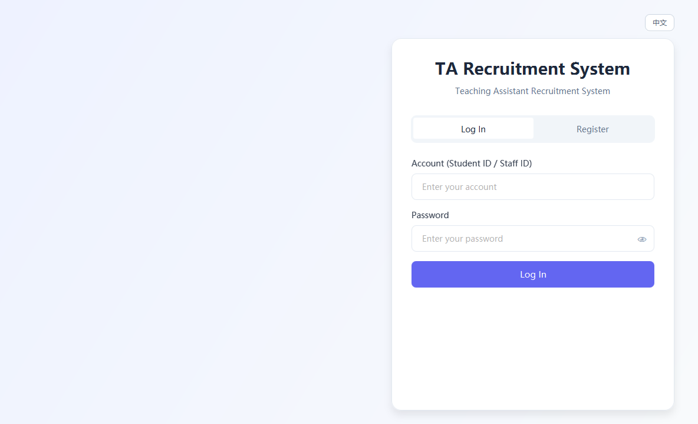
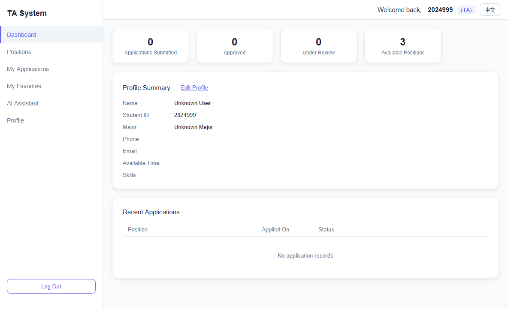
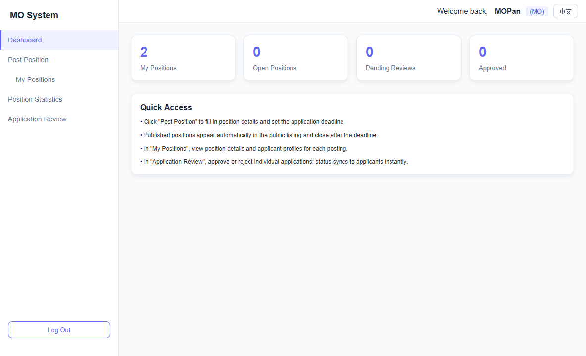
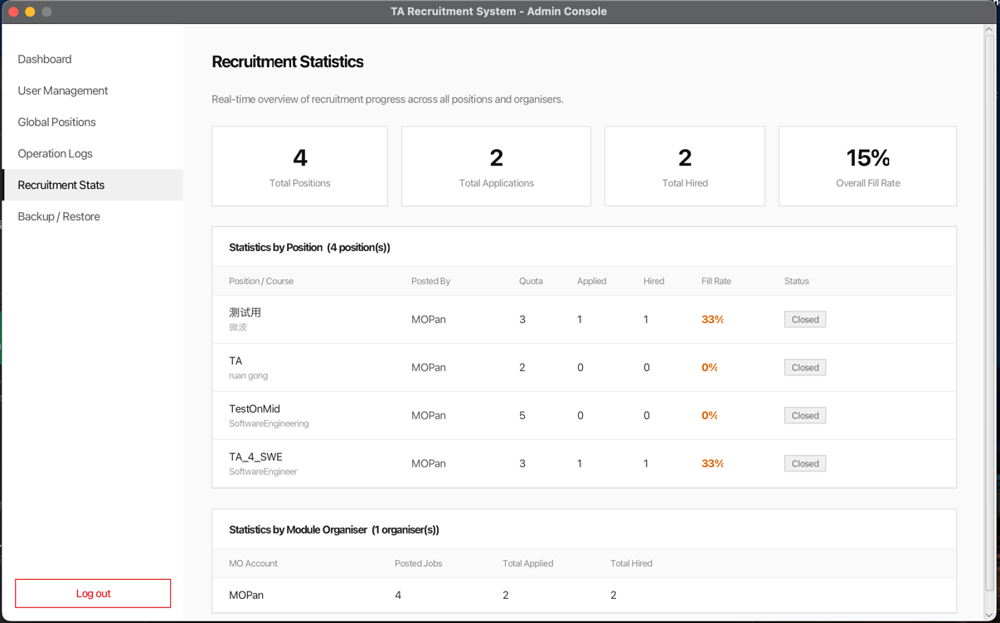

# User Manual - TA Recruitment System

## Overview

The TA Recruitment System is a JavaFX desktop application for managing teaching assistant recruitment. It supports three user roles:

- TA applicants browse positions, maintain profiles, submit applications, and track results.
- Module Organisers publish positions, review applications, and manage position status.
- Admin users manage accounts, inspect logs, review recruitment statistics, export data, and perform backup/restore tasks.

## Starting the Application

1. Install JDK 21 and Maven.
2. Open a terminal in the project directory.
3. Run `mvn test` once to compile and verify the project.
4. Run `mvn javafx:run` to start the configured JavaFX entry point.

For the complete login workflow, run `LoginScreen.LoginMain` from an IDE or set the Maven JavaFX `mainClass` to `LoginScreen.LoginMain`.

## Main Frame: Login

The login frame allows users to log in or register. Registration supports TA, MO, and Admin roles; Admin registration requires the authorisation code `BUPTAdmin`.

## Main Frame: TA

After a TA logs in, the TA frame shows dashboard statistics, profile summary, recent applications, and navigation to positions, applications, favourites, the AI assistant, and profile management.

Key TA workflows:

- Browse and filter available TA positions.
- Submit an application with profile information and attachments.
- View application status and module organiser comments.
- Maintain the TA profile and skills.

## Main Frame: Module Organiser

The MO frame provides position publishing and application review features. The dashboard gives quick access to position counts, open positions, pending reviews, and approved applications.

Key MO workflows:

- Post a new position with course information, recruitment count, requirements, deadline, and required skills.
- View and manage existing positions.
- Review TA applications individually or in batch.
- Approve, reject, or undo review decisions.

## Main Frame: Admin

The Admin frame provides system-level management. It includes account management, global positions, operation logs, recruitment statistics, workload alerts, data export, and backup/restore functions.

Key Admin workflows:

- View all TA, MO, and Admin accounts.
- Reset user passwords or delete accounts where appropriate.
- Review operation logs.
- Inspect recruitment statistics across positions and organisers.
- Export JSON data and manage backups.

## Sample Accounts

| Role | Account | Password |
|------|---------|----------|
| TA | `TAPan` | `123456` |
| MO | `MOPan` | `123456` |
| Admin | `Admin001` | `123456` |

## Data Storage

The application uses local JSON files instead of a database:

- `data/TAData/` stores TA profiles.
- `data/MOData/` stores MO accounts.
- `data/AdminData/` stores Admin accounts.
- `data/JobData/` stores positions.
- `data/ApplicationData/` stores application records.
- `data/Logs/` stores operation logs.

## Troubleshooting

- If dependencies cannot be resolved, check network access and rerun `mvn test`.
- If JavaFX cannot start, confirm that JDK 21 is selected in the terminal or IDE.
- If sample data is missing, ensure the `data/` directory was extracted with the package.
